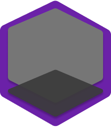

# Notes Scribe
     

[Notes Scribe](https://notes-scribe.com) is a web app made for creating and organizing notes.

It can be accessed through `https://notes-scribe.com`

## About

This notes web app is designed to streamline your organization process effortlessly. With intuitive features and a user-friendly interface, it's the perfect tool for keeping your notes in order.

## Tech Stack

### Frontend
|       |  |
| ----------- | ----------- |
|            | Angular       |
|    | Tailwind    |
|             | Aws      |
|            |       |

### Backend
|        |  |
| ----------- |  ------------ |
| | NestJS       |
|  | Google Cloud |
|  | FireBase |
|            |       |

### Design
|        |  |
| ----------- | ------------- |
|                | Figma         |
|   | Font Awesome  |
|            |       |

The front end is hosted on AWS S3 buckets.

The backend is deployed on a server on Google App Engine.

[Frontend Repository](https://github.com/Keerthi598/notes)

[Backend Repository]()

## Help 

Contact rameshke@msu.edu 

## License

Nest is [MIT licensed]().
